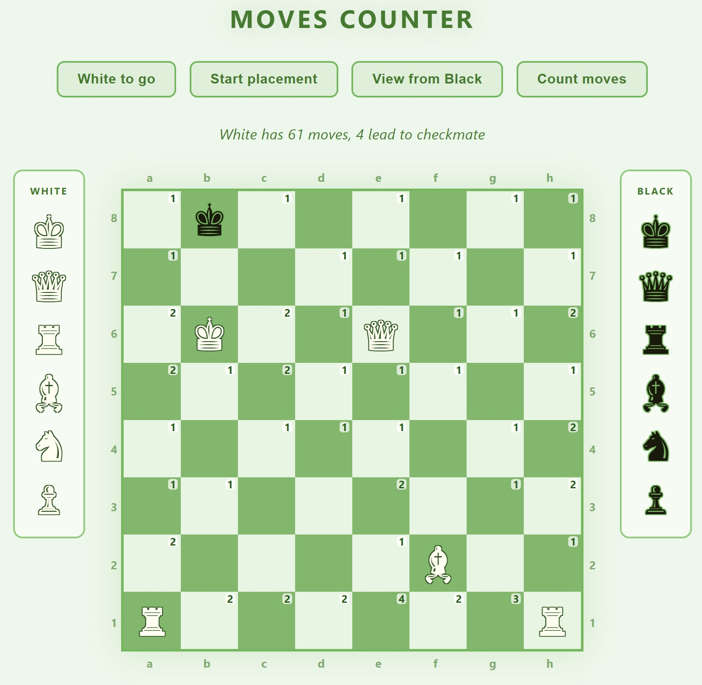

# chess-moves-counter

A browser-based chess board editor that counts legal moves from any custom position. Built with pure Python in the browser via [Brython](https://brython.info/) — no backend required.

Hosted on (fill later)



## Features

- Drag pieces from the side panels onto the board to set up any position
- Drag pieces between squares or off the board to remove them
- Toggle between the standard starting position and an empty board
- Flip the board to view from White's or Black's perspective
- Select whose turn it is (White / Black)
- Count legal moves for the active side, including castling and en passant
- Each square shows how many pieces can land on it next move
- Stats display total moves and how many immediately deliver checkmate

## Local development

```bash
python3 -m http.server 8000
```

Then open http://localhost:8000 in your browser.

## TODO

- Add moves history to fix en passant and castling
- Add ability to count moves for more turns
